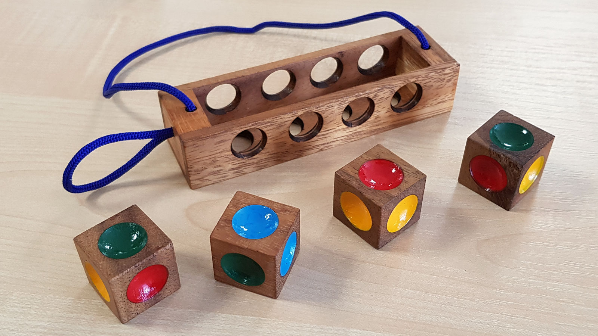

# Color Matching Dice
Arrange 4 colored side dice in a row so that no color repeats itself on either side.



## The Dice
Die | Top | Left | Front | Right | Rear | Bottom
--- | --- | --- | --- | --- | --- | ---
#1 | Green | Yellow | Blue | Yellow | Red | Yellow
#2 | Green | Blue | Blue | Yellow | Red | Green
#3 | Red | Yellow | Yellow | Blue | Red | Green
#4 | Yellow | Blue | Green | Red | Red | Green

## Find All Possible Solutions
```
git clone https://github.com/chiswicked/color-matching-dice.git
cd color-matching-dice
go run main.go
```